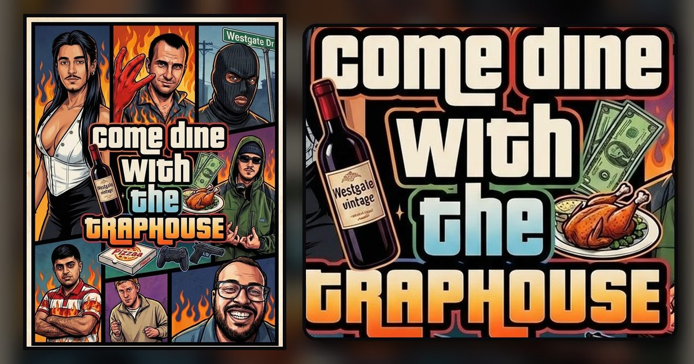

# Come Dine With The Traphouse

The event portal for our Come Dine With Me series. Five teams of two, and every team hosts one dinner.



## What it does

- **The rotation.** Every night, who's hosting, who's coming, the date and the theme, plus a "who's where" grid. One-tap "add to calendar" for Apple, Outlook and Google.
- **Team logins with no passwords.** Each team gets a secret link (and a 6 letter backup code). Tapping the link logs that phone in as the team.
- **Scorecards.** At the end of each night every guest team hands in one scorecard for the hosts: a secret overall score out of 10, star ratings for Starter, Main, Dessert, Drinks and Vibe, and an optional anonymous "taxi confessional". You can't score your own dinner. Cards can be edited until they lock at midday the next day.
- **Sealed scores.** Nobody sees any score (not even the organiser, unless they choose to peek) until the Grand Reveal. Or switch to night-by-night reveals for a running leaderboard.
- **The Grand Reveal.** A presenter mode for the TV: each team from last place to first, scores flipping in one guest at a time, the taxi confessionals, a WASTED screen for last place, a drum roll, MISSION PASSED with money rain for the winner, then the awards. Everyone else can follow along live on their phones.
- **Awards.** Best Starter/Main/Dessert/Drinks/Vibe, Harshest Critic, Most Generous, Highest Single Score, Lowest Blow and Biggest Beef.
- **Hosting tools.** Hosts set their theme, dress code, address (only visible to logged-in teams), menu (kept secret until they reveal it) and a message for guests. They can also see their guests' dietary requirements.
- **GTA portraits.** Each team uploads a photo of the two of them, plus one of each player, and Google's Nano Banana Pro (the same image AI family the poster was made with) redraws them in the poster's GTA cover art style, using panels from the poster as its style reference and the same wording as the poster prompt. Portraits made elsewhere, like the Gemini app, can be uploaded as is. They're used for the team badges, crew cards and the Grand Reveal.
- **GTA touches throughout.** White-on-black GTA lettering, a black and white screen with "mission passed!" when you hand in a scorecard, WASTED and BUSTED screens, a GTA-style loading screen and GTA V style notifications.
- **Food photos.** Upload pics per night (optional, needs a Vercel Blob store).
- **Organiser control room.** Setup wizard, team names and characters (cropped from the poster), invite links and QR codes, dates and hosts, scoring overrides, a scorecard tracker, CSV export, backup and restore.
- Works on phones first, can be added to the home screen, and shows a proper link preview in WhatsApp and iMessage.

## Getting it live on Vercel

You only need to do this once. It takes about 5 minutes.

1. **Import the repo.** In Vercel, click **Add New > Project**, pick this GitHub repo and click **Deploy**. Leave the settings as they are (the repo's `vercel.json` handles them).
2. **Add the database.** Open the project, go to the **Storage** tab, click **Create Database**, pick **Upstash for Redis** and choose the free plan and the **Sydney** region (the API runs in Sydney too, so it stays fast). Connect it to the project. Vercel adds the `KV_REST_API_URL` and `KV_REST_API_TOKEN` settings for you.
3. **(Optional) Switch on photos.** In the same Storage tab, create a **Blob** store and connect it to the project.
4. **Redeploy.** Go to **Deployments**, open the latest one and click **Redeploy**, so it picks up the new storage.
5. **Claim the organiser role straight away.** Open your site and tap **I'm the organiser**. Whoever does this first becomes the organiser, so do it before sharing the link. (To lock it down first, add an `ADMIN_PIN` environment variable in Vercel before deploying. Then only that PIN can set things up.)
6. **Run the setup wizard.** Pick your PIN, enter team names and players, and set the first dinner date and the hosting order.
7. **Send the invites.** In **Control room > Teams & invites**, tap **Send invite** for each team. It opens your phone's share sheet with a ready-made WhatsApp message including their secret link. There's also **Copy all invites** and a QR code per team.

If the site says "Connect the database", steps 2 and 4 haven't happened yet.

### GTA portraits (AI)

Portraits are drawn by **Nano Banana Pro** (Google's Gemini 3 Pro Image) through **Vercel AI Gateway**, billed to your Vercel account at Google's rates: about US$0.13 per portrait. If Pro is unavailable it falls back to Nano Banana 2, then the original Nano Banana. On Vercel there is no key to set up: the portal signs in with the project's OIDC token automatically.

- If uploads say AI portraits "are not connected", check **Settings > Security > Secure backend access with OIDC federation** is on, or create an AI Gateway API key in the Vercel dashboard (**AI Gateway > API keys**) and add it as the `AI_GATEWAY_API_KEY` environment variable.
- If they say it's "out of credit", top up AI Gateway credits in the Vercel dashboard.
- Each team gets 8 AI goes (each redraw is one). The organiser can reset a team's goes under **Teams & invites > Edit**, and can make portraits for any team from there too.
- Original photos are only used to draw the portrait and are never stored. The finished portraits are kept in the Redis database, so no Blob store is needed.
- Anyone can also upload a portrait they made themselves (for example in the Gemini app) and choose **Use as is**. That works even with AI switched off.

### The real GTA font (optional)

The site uses Luckiest Guy, a free lookalike. For the actual GTA font, download **Pricedown** (free, by Typodermic), put the file in `public/fonts/` (any name containing "pricedown", as `.woff2`, `.woff`, `.ttf` or `.otf`) and push. The next deploy switches every GTA heading over to it automatically.

## On the night

- Hosts: fill in your theme, address and menu under **My team** (the menu stays secret until you tick "reveal").
- Guests: scoring opens automatically when the dinner starts. Before you leave, one of you taps **Score** and hands in your team's card.
- The organiser can force scoring open or locked for any night from **Control room > Nights** if plans change.

## The Grand Reveal

After the last dinner, open **Control room > Reveal > Open presenter screen** on the laptop connected to the TV. Tap **Start the Grand Reveal**, then click **Next** (or use the arrow keys or a presentation clicker) to go through each screen. Starting the reveal locks all scorecards. Once it's finished, the full leaderboard is public and anyone can replay the reveal.

## Running it locally

```bash
npm install
npm run dev        # http://localhost:3000, data kept in .data/db.json
npm run dev -- --reset   # start again with an empty database
npm test           # plays through a whole event against a throwaway database
```

With no Redis keys set, the dev server stores everything in a local file, so you can try the whole flow (setup, scoring, reveal, photos) without any accounts. To use your real Upstash database locally, copy `KV_REST_API_URL` and `KV_REST_API_TOKEN` from Vercel into your shell first.

## How it's built

- `public/` is the site. Plain ES modules with [Preact](https://preactjs.com) and [htm](https://github.com/developit/htm), no build step. Pages live in `public/js/views/`.
- `public/js/shared/core.js` holds the rules and maths (night status, results, awards, the reveal script). The browser and the API both use it.
- `api/` holds the Vercel Functions: `version`, `state`, `auth`, `team`, `admin`, `avatar`, `photos` and `calendar`. Shared server code is in `lib/` (`lib/gta-art.js` is the AI portrait artist).
- Data lives in Upstash Redis. Phones poll a tiny, CDN-cached `/api/version` and only download the full state when something changes, so a whole series fits comfortably in Upstash's free tier.
- Privacy: addresses, dietary requirements, team codes and every score stay off the public API until they're meant to be seen.

### Settings (environment variables)

| Name | Required | What it does |
| --- | --- | --- |
| `KV_REST_API_URL`, `KV_REST_API_TOKEN` | Yes | Added automatically when you connect Upstash Redis. |
| `BLOB_READ_WRITE_TOKEN` | For photos | Added automatically when you connect a Blob store. |
| `ADMIN_PIN` | Optional | Fixes the organiser PIN. Handy as a backup if the PIN is forgotten. |
| `AI_GATEWAY_API_KEY` | Optional | Only needed for AI portraits if OIDC isn't available (or when running locally). |
| `AVATAR_MODEL` | Optional | Image model for portraits. Default `google/gemini-3-pro-image` (Nano Banana Pro). `google/gemini-3.1-flash-image` (Nano Banana 2) is faster and cheaper. |
| `AVATAR_LIMIT` | Optional | AI portrait goes per team (default 8). |
| `AVATAR_AI` | Optional | `off` to disable AI portraits (uploading finished portraits still works), `mock` for local testing. |
| `SESSION_SECRET` | Optional | Signs logins. Defaults to a value derived from the Redis token. |
| `KEY_PREFIX` | Optional | Prefix for Redis keys if you share the database (default `cdwm:`). |

## Credits

Poster art by the crew. Fonts: Luckiest Guy, Barlow Condensed and Rubik (SIL Open Font License). Libraries: Preact and htm (MIT), qrcode-generator (MIT), Vercel AI SDK (Apache 2.0).
